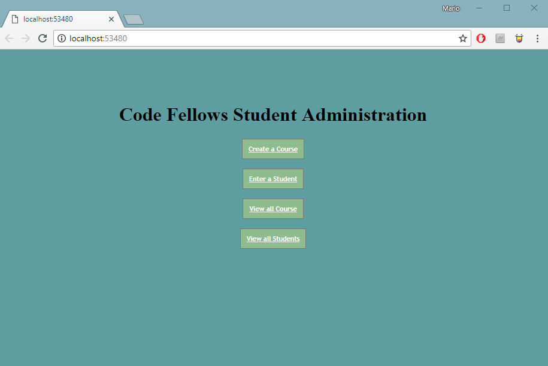

# Student_Enrollment
An ASP.NET Core MVC app that allows for students and courses to be created,
read, updated, and deleted.

## Details
Our goal for this application was to create an MVC app that allows users
to create new courses and students and store that information in a database.
Each student created can only have one course at a time. Both the course
and the students can be updated and that change will also be saved. There 
is an option to view all students or courses. An option to see more details
on courses is also availble. Students can be deleted at any time. Courses
can only be deleted if there are no students in that course. 

## What you need
* The Application is deployed using Microsoft Azure
* SQL is used for Database
* Deployed Link: https://marionstudentenrollment.azurewebsites.net/
* Install the latest Visual Studio 2017
* Have Windows OS on your device

## How to Open App
* Fork the Student_Enrollment repo from [my GitHub Page](https://github.com/Calamario)
* Git Clone the repo onto your local device
* Open .sln file with Visual Studio

## Other Details
* Microsoft Azure
* Visual Studio

## What it looks like

